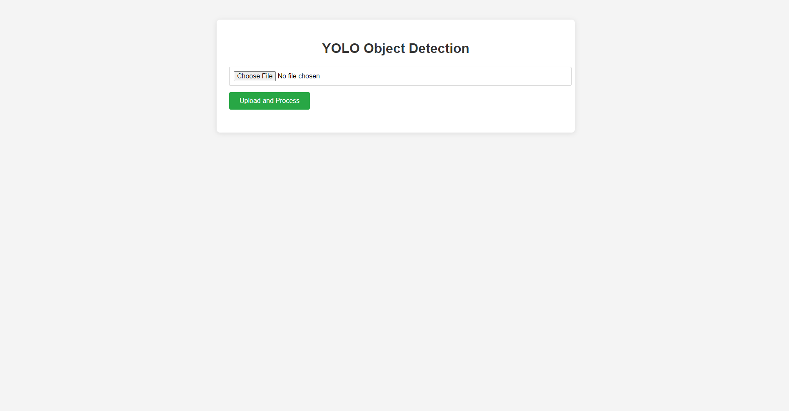

# VisionWear


<a href="https://www.flaticon.com/free-icons/clothing" title="clothing icons">Clothing icons created by Freepik - Flaticon</a>

## Introduction

Welcome to the VisionWear project! This Flask-based web application empowers users to upload videos, perform real-time object detection using the YOLO (You Only Look Once) model, and efficiently search through detections using FAISS (Facebook AI Similarity Search). Whether you're analyzing surveillance footage, creating annotated videos, or conducting research, this tool provides a robust and user-friendly interface to streamline your workflow.

## Features

- **Video Upload**: Seamlessly upload videos in popular formats such as MP4, AVI, MOV, and MKV.
- **Real-Time Object Detection**: Utilize the powerful YOLO model to detect and categorize objects within each frame of the uploaded video.
- **Feature Encoding**: Encode detection features using Sentence Transformers for enhanced similarity search capabilities.
- **Efficient Similarity Search**: Implement FAISS to index and search through detections, enabling quick retrieval of similar objects based on class name, timestamp, and bounding box.
- **Annotated Video Generation**: Generate and view annotated videos that highlight selected object classes, making it easier to focus on areas of interest.
- **User-Friendly Interface**: Intuitive web interface designed for ease of use, ensuring a smooth user experience even for those without technical expertise.
- **Search Functionality**: Advanced search options to query detections based on specific criteria, enhancing data analysis and exploration.

## Demo

  
*Upload your video to get started.*

  
*Choose the classes you want to highlight in the annotated video.*

  
*View the generated annotated video with highlighted objects.*

  
*Search for specific detections using class name, timestamp, and bounding box.*

  
*Review the search results with detailed information and frame snapshots.*

## File Description

Here's a brief overview of the project's directory structure and key files:


- **`app.py`**: The main Flask application file that initializes the app, defines routes, and integrates functionalities from utility modules.
- **`requirements.txt`**: Lists all Python dependencies required for the project.
- **`models/best.pt`**: The pre-trained YOLO model file used for object detection.
- **`utils/encoding.py`**: Contains functions related to feature encoding using Sentence Transformers.
- **`utils/processing.py`**: Contains functions for processing videos, performing object detection, extracting frames, and creating annotated videos.
- **`templates/`**: Holds HTML template files for different pages of the application.
  - **`main.html`**: Template for the home page where users upload videos and select classes.
  - **`search.html`**: Template for the search page where users can query detections.
  - **`search_results.html`**: Template to display the results of search queries.
- **`static/`**: Contains static assets such as CSS files, uploaded videos, frames, annotated videos, and images.
  - **`css/styles.css`**: Centralized CSS file for styling the application's frontend.
  - **`uploads/`**, **`frames/`**, **`videos/`**: Directories for storing user-uploaded videos, extracted frames, and generated annotated videos respectively.
  - **`images/`**: Directory for storing images used in the README, such as the project logo and demo screenshots.

## Installation

Follow these steps to set up the project on your local machine:

1. **Clone the Repository**

   ```bash
   git clone https://github.com/ishubhranshu/vision_wear.git
   cd vision_wear
